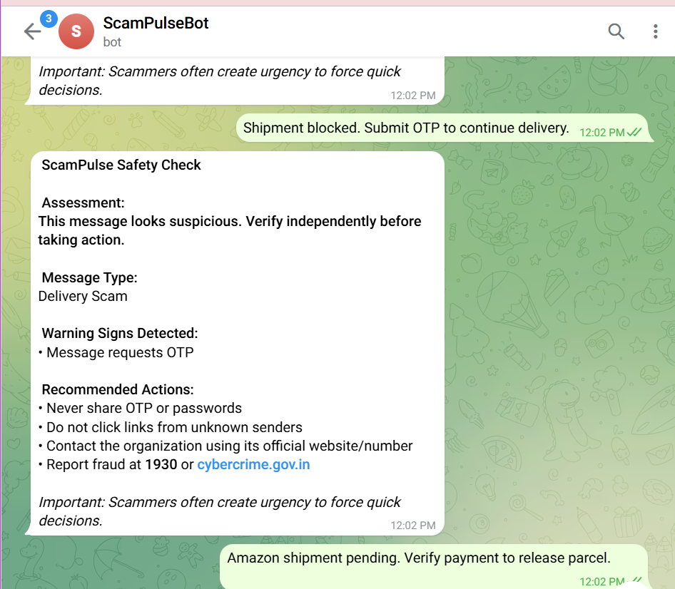
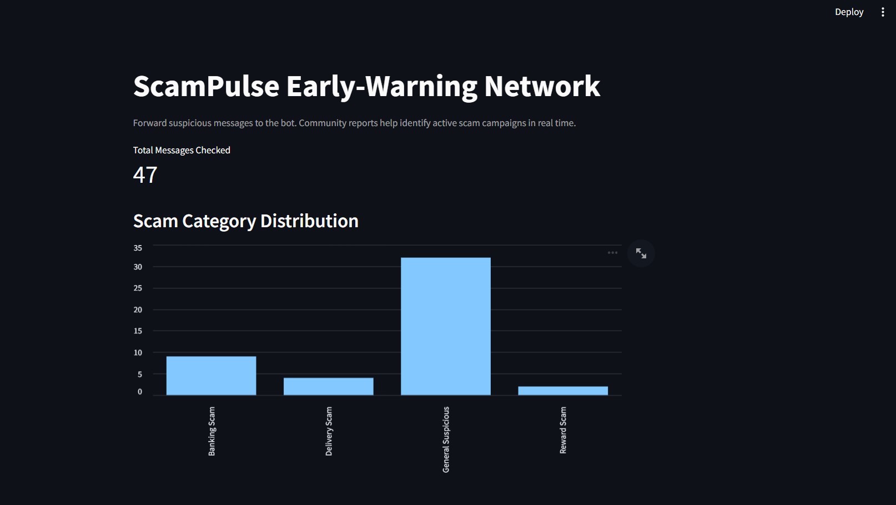

# ScamPulse – Community Fraud Early Warning System
## Live Demo

### Telegram Safety Response

### Community Fraud Dashboard

ScamPulse is a real-time digital fraud awareness platform designed to help users identify scam SMS or WhatsApp messages before they act on them.

Users forward suspicious messages to a Telegram bot.  
The system analyzes the message using a hybrid approach:
- Rule-based fraud indicators (OTP requests, urgency, impersonation)
- Machine learning NLP spam classifier

The bot returns:
- A clear warning
- Explanation of why the message is dangerous
- Safety guidance

Each analyzed message is logged and visualized on a Streamlit dashboard to detect active scam campaigns in the community.

## Technologies
Python, Scikit-learn, Pandas, Streamlit, Telegram Bot API

## How to Run

1. Install dependencies
pip install -r requirements.txt

2. Run the Telegram bot
python bot.py

3. Run the dashboard
streamlit run dashboard.py
